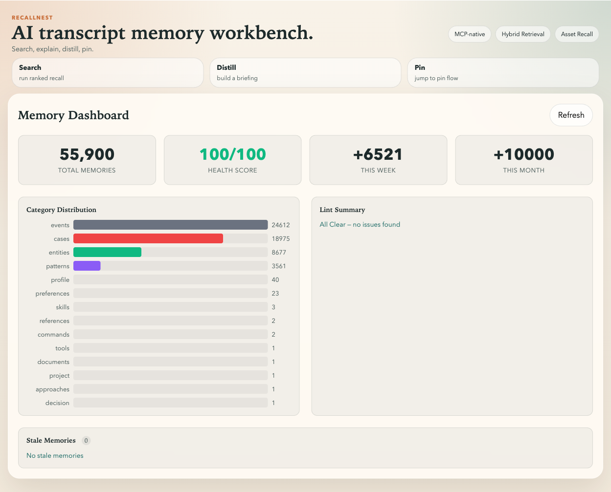
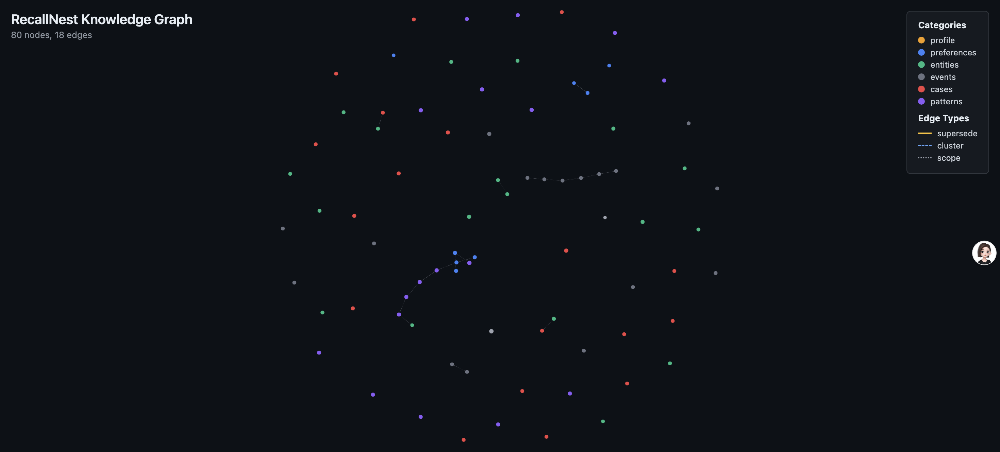
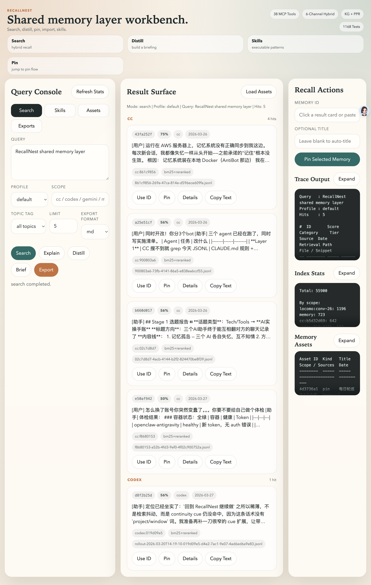

<div align="center">

# RecallNest

**Shared Memory Layer for Claude Code, Codex, and Gemini CLI**

*One memory. Three terminals. Context that survives across windows.*

A local-first memory system backed by LanceDB that turns scattered conversation history into reusable knowledge — shared across your coding agents, recalled automatically.

[](https://github.com/AliceLJY/recallnest)
[](LICENSE)
[](https://bun.sh)
[](https://lancedb.com)
[](https://modelcontextprotocol.io)
[](https://github.com/AliceLJY/recallnest)
[](https://github.com/AliceLJY/recallnest)

**English** | [简体中文](README_CN.md) | [Roadmap](ROADMAP.md)

</div>

---

## Why RecallNest?

Coding agents forget everything between windows. Your context — project configs, debugging decisions, entity mappings — is scattered across Claude Code, Codex, and Gemini CLI with no shared memory.

RecallNest solves this: **a single LanceDB-backed memory layer that all three terminals read and write**. Context stored in one window is auto-recalled in another. Sessions checkpoint on exit and resume on start. Memory decays, evolves, and self-organizes — not just raw log storage.

### Benchmark: LongMemEval (ICLR 2025)

Evaluated on 500 questions across 6 memory abilities ([methodology](https://arxiv.org/abs/2407.15168)):

| | RecallNest | Vector-only baseline | Delta |
|---|---|---|---|
| Overall Accuracy | **29.6%** | 24.2% | **+5.4pp** |
| User Facts | **64.3%** | 52.9% | +11.4pp |
| Knowledge Update | **43.6%** | 42.3% | +1.3pp |
| Abstention Rate | **55.6%** | 67.8% | **−12.2pp** |

Wins or ties in **all 6 categories**, with no regression. The hybrid retrieval pipeline (BM25 + vector + recency + RIF dedup) surfaces 12.2% more relevant context than vector-only search.

### Memory Dashboard

See your memories grow — total count, category distribution, health score, and growth trends at a glance.

<p align="center">
  
</p>

### Knowledge Graph

Visualize your memory network as an interactive force-directed graph. Each node is a memory, colored by category. **Semantic bridges** (pink lines) reveal hidden cross-domain connections — knowledge that lives in different scopes but shares the same underlying insight.

<p align="center">
  
</p>

### What you get

| | Capability |
|---|---|
| **CC Plugin** | Install in Claude Code with one command — no manual config |
| **Shared Index** | One LanceDB store for Claude Code, Codex, and Gemini CLI |
| **Dual Interface** | MCP (stdio) for CLI tools + HTTP API for custom agents |
| **One-Click Setup** | Integration scripts install MCP access and continuity rules |
| **Hybrid Retrieval** | Vector + BM25 + reranking + Weibull decay + tier promotion |
| **KG Graph Traversal** | Entity relation graph with PPR algorithm for multi-hop questions |
| **Session Continuity** | `checkpoint_session` + `resume_context` (full/light/summary modes) |
| **Session Distiller** | 3-layer conversation compression: microcompact → LLM summary → knowledge extraction |
| **Conversation Import** | Import from Claude Code, Claude.ai, ChatGPT, Slack, and plaintext |
| **Topic Tags** | Intra-scope topic partitioning — auto-detected, filterable in search |
| **Memory Evolution** | Supersede chains, decay scoring, LLM importance, consolidation, archival |
| **Skill Memory** | Store, retrieve, and promote executable skills from recurring patterns |
| **Workflow Observation** | Dedicated append-only workflow health records, outside regular memory |
| **Structured Assets** | Pins, briefs, and distilled summaries — not just raw logs |
| **Smart Promotion** | Evidence → durable memory with conflict guards and merge resolution |
| **6 Categories** | profile, preferences, entities, events, cases, patterns |
| **4 Retrieval Profiles** | default, writing, debug, fact-check — tuned for different tasks |
| **Admission Control** | Write-time gating: noise filter, importance floor, rate limiting |
| **Memory Lint** | Contradiction, duplicate, stale, and orphan detection with health score |
| **Knowledge Graph** | Export interactive HTML visualization of your memory network |
| **Dashboard** | Web UI with stats, category distribution, growth trends, and health |

---

## Highlights (v2.0)

RecallNest has evolved from a simple transcript search tool into a full **memory operating system**:

| Metric | Value |
|--------|-------|
| Core code | 31,800+ lines across 108 source files |
| MCP tools | 40 tools in 3 tiers (core / advanced / governance) |
| HTTP endpoints | 21 REST endpoints |
| Test coverage | 1,168 tests, 0 failures |
| Retrieval | 6-channel hybrid: vector + BM25 + L0/L1/L2 multi-vector + KG graph (PPR) |
| Memory evolution | Supersede chains, Weibull decay, LLM importance scoring, auto-archival |

**New in this release:**

- **Session Distiller** — 3-layer conversation compression (microcompact → LLM structured summary → knowledge extraction to durable memory)
- **Conversation Import** — bring your history from Claude Code, Claude.ai, ChatGPT, Slack, or plaintext — auto-detected
- **Topic Tags** — intra-scope topic partitioning with 15 auto-detected topics, filterable in `search_memory`
- **Ultra-Light Wake-up** — `resume_context(mode='light')` returns <300 tokens for low-budget terminals
- **Skill Memory** — store, retrieve, and auto-promote executable skills from recurring patterns
- **Admission Control** — write-time gating with noise filter, importance floor, dedup, and rate limiting
- **Memory Lint** — content quality checker with health score (contradictions, duplicates, stale, orphans)
- **Knowledge Graph** — interactive D3.js force-directed visualization with cross-scope semantic bridges

### Architecture Highlights

RecallNest is not just a vector search wrapper. Key design decisions:

- **Weibull Decay + Importance Modulation** — memories decay along a parametric Weibull curve; importance scores (LLM-assessed with anchored rubrics) modulate the half-life, so core identity facts persist while transient details fade naturally
- **L0 / L1 / L2 Dynamic Folding** — every memory stores 3 granularity layers (one-liner / bullet summary / full content); retrieval dynamically selects which layer to return based on relevance score and token budget
- **Vector Pre-filter + LLM Dedup** — 90% of dedup decisions use cheap cosine similarity (≥ 0.92); only borderline cases invoke LLM judgment, keeping costs low without sacrificing accuracy
- **Category-Aware Merge Strategies** — `profile` and `preferences` use merge-on-conflict (latest wins); `events` and `cases` use append-only (history preserved). No one-size-fits-all
- **Display Score vs Elimination Score** — retrieval uses a dual-track system: tier floor prevents core memories from ever dropping out, while decay boost lets fresh memories surface temporarily without permanently displacing stable ones

---

## Web UI

<div align="center">

<p><em>Search Workbench: hybrid search with topic tag filtering, 4 retrieval profiles, Skills browser, and asset management.</em></p>
</div>

```bash
cd ~/recallnest && bun run src/ui-server.ts
# → http://localhost:4317
```

---

## Quick Start

### Option A: Claude Code Plugin (recommended)

```bash
/plugin marketplace add AliceLJY/recallnest
/plugin install recallnest@AliceLJY
```

RecallNest starts automatically with Claude Code. No manual MCP config needed.

> **Requires:** [Bun](https://bun.sh) runtime. Dependencies install on first start.

### Option B: Manual setup

```bash
git clone https://github.com/AliceLJY/recallnest.git
cd recallnest
bun install
cp config.json.example config.json
cp .env.example .env
# Edit .env → add your JINA_API_KEY
```

### Start the server

```bash
bun run api
# → RecallNest API running at http://localhost:4318
```

### Try it

```bash
# Store a memory
curl -X POST http://localhost:4318/v1/store \
  -H "Content-Type: application/json" \
  -d '{"text": "User prefers dark mode", "category": "preferences"}'

# Recall memories
curl -X POST http://localhost:4318/v1/recall \
  -H "Content-Type: application/json" \
  -d '{"query": "user preferences"}'

# Check stats
curl http://localhost:4318/v1/stats
```

### Connect your terminals

```bash
bash integrations/claude-code/setup.sh
bash integrations/gemini-cli/setup.sh
bash integrations/codex/setup.sh
```

Each script installs MCP access and managed continuity rules, so `resume_context` fires automatically in fresh windows.

### Index existing conversations

```bash
bun run src/cli.ts ingest --source all
bun run seed:continuity
bun run src/cli.ts doctor
```

---

## Multilingual Support

RecallNest works out of the box with English. For multilingual memory (Chinese, Japanese, Thai, and 20+ more), install [babel-memory](https://github.com/AliceLJY/babel-memory) with the language packs you need:

```bash
# Chinese
npm install babel-memory jieba-wasm

# Japanese
npm install babel-memory @sglkc/kuromoji

# Thai
npm install babel-memory wordcut

# European languages (German, French, Spanish, Russian, etc.)
npm install babel-memory snowball-stemmers

# Multiple languages at once
npm install babel-memory jieba-wasm @sglkc/kuromoji snowball-stemmers
```

RecallNest auto-detects babel-memory at startup — no configuration needed. Without babel-memory, RecallNest still works perfectly with standard BM25 text search.

---

## Architecture

```
┌──────────────────────────────────────────────────────────┐
│                     Client Layer                          │
├──────────┬──────────┬──────────┬──────────────────────────┤
│ Claude   │ Gemini   │ Codex    │ Custom Agents / curl     │
│ Code     │ CLI      │          │                          │
└────┬─────┴────┬─────┴────┬─────┴──────┬──────────────────┘
     │          │          │            │
     └──── MCP (stdio) ───┘     HTTP API (port 4318)
                │                       │
                ▼                       ▼
┌──────────────────────────────────────────────────────────┐
│                   Integration Layer                       │
│  ┌─────────────────────┐  ┌────────────────────────────┐ │
│  │  MCP Server         │  │  HTTP API Server           │ │
│  │  29 tools           │  │  19 endpoints              │ │
│  └─────────┬───────────┘  └──────────┬─────────────────┘ │
└────────────┼─────────────────────────┼───────────────────┘
             └──────────┬──────────────┘
                        ▼
┌──────────────────────────────────────────────────────────┐
│                     Core Engine                           │
│                                                           │
│  ┌────────────┐  ┌────────────┐  ┌─────────────────────┐ │
│  │ Retriever  │  │ Classifier │  │ Context Composer     │ │
│  │ (vector +  │  │ (6 cats)   │  │ (resume_context)     │ │
│  │ BM25 + RRF)│  │            │  │                      │ │
│  └────────────┘  └────────────┘  └──────────────────────┘ │
│  ┌────────────┐  ┌────────────┐  ┌─────────────────────┐ │
│  │ Decay      │  │ Conflict   │  │ Capture Engine       │ │
│  │ Engine     │  │ Engine     │  │ (evidence → durable) │ │
│  │ (Weibull)  │  │ (audit +   │  │                      │ │
│  │            │  │  merge)    │  │                      │ │
│  └────────────┘  └────────────┘  └──────────────────────┘ │
└──────────────────────────┬───────────────────────────────┘
                           ▼
┌──────────────────────────────────────────────────────────┐
│                    Storage Layer                          │
│  ┌─────────────────────┐  ┌────────────────────────────┐ │
│  │ LanceDB             │  │ Jina Embeddings v5         │ │
│  │ (vector + columnar) │  │ (1024-dim, task-aware)     │ │
│  └─────────────────────┘  └────────────────────────────┘ │
└──────────────────────────────────────────────────────────┘
```

> Full architecture deep-dive: [`docs/architecture.md`](docs/architecture.md)

---

## Integrations

RecallNest serves two interfaces:

- **MCP** — for Claude Code, Gemini CLI, and Codex (native tool access)
- **HTTP API** — for custom agents, SDK-based apps, and any HTTP client

### Agent framework examples

Examples live in [`integrations/examples/`](integrations/examples/):

| Framework | Example | Language |
|-----------|---------|----------|
| [Claude Agent SDK](integrations/examples/claude-agent-sdk/) | `memory-agent.ts` | TypeScript |
| [OpenAI Agents SDK](integrations/examples/openai-agents-sdk/) | `memory-agent.py` | Python |
| [LangChain](integrations/examples/langchain/) | `memory-chain.py` | Python |

---

## Core Features

### Hybrid Retrieval

```
Query → Embedding ──┐
                    ├── Hybrid Fusion → Rerank → Weibull Decay → Filter → Top-K
Query → BM25 FTS ──┘
```

- **Vector search** — semantic similarity via LanceDB ANN
- **BM25 full-text search** — exact keyword matching via LanceDB FTS
- **Hybrid fusion** — vector + BM25 combined scoring
- **Reranking** — Jina cross-encoder reranking
- **Decay + tiering** — Weibull freshness model with Core / Working / Peripheral tiers

### Session Continuity

The killer feature for multi-window workflows:

- **`checkpoint_session`** — snapshot current work state (decisions, open loops, next actions)
- **Repo-state guard** — saved checkpoints strip `git status` / modified-file text so volatile repo state does not contaminate later handoffs
- **`resume_context`** — compose startup context from checkpoints + durable memory + pins
- **Managed rules** — integration scripts install continuity rules so `resume_context` fires automatically

### Workflow Observation

RecallNest now keeps workflow observations in a dedicated append-only store instead of stuffing them into the regular memory index:

- **`workflow_observe`** — record whether `resume_context`, `checkpoint_session`, or another workflow primitive succeeded, failed, was corrected, or was missed
- **`workflow_health`** — aggregate 7d / 30d health for one workflow or show a degraded-workflow dashboard
- **`workflow_evidence`** — package recent issue observations, top signals, and suggested next actions for debugging

These records live under `data/workflow-observations`, not in the 6 memory categories, and they are never composed into `resume_context` as stable recall.
Managed MCP / HTTP continuity calls now append observations automatically for `resume_context` and `checkpoint_session`, while repo-state sanitization is recorded as a `corrected` checkpoint observation instead of polluting durable memory.

### Memory Promotion & Conflict Resolution

Raw transcripts don't silently become long-term memory:

- **Evidence → durable** — explicit `promote_memory` with `canonicalKey` and provenance
- **Conflict guards** — canonical-key collisions surface as conflict candidates
- **Resolution** — keep existing, accept new, or merge — with advice and cluster views
- **Audit + escalation** — `conflicts audit --export` for operational review

### Retrieval Profiles

| Profile | Best for | Bias |
|---------|----------|------|
| `default` | Everyday recall | Balanced |
| `writing` | Drafting and idea mining | Broader semantic, older material OK |
| `debug` | Errors, commands, fixes | Keyword-heavy, recency-biased |
| `fact-check` | Evidence lookup | Tighter cutoff, exact-match bias |

### Memory Categories

| Category | Description | Strategy |
|----------|-------------|----------|
| `profile` | User identity and background | Merge |
| `preferences` | Habits, style, dislikes | Merge |
| `entities` | Projects, tools, people | Merge |
| `events` | Things that happened | Append |
| `cases` | Problem → solution pairs | Append |
| `patterns` | Reusable workflows | Merge |

Details: [`docs/memory-categories.md`](docs/memory-categories.md)

---

<details>
<summary><strong>MCP Tools (40 tools)</strong></summary>

| Tool | Description |
|------|-------------|
| `workflow_observe` | Store an append-only workflow observation outside regular memory |
| `workflow_health` | Inspect workflow observation health or show a degraded-workflow dashboard |
| `workflow_evidence` | Build an evidence pack for a workflow primitive |
| `store_memory` | Store a durable memory for future windows |
| `store_workflow_pattern` | Store a reusable workflow as durable `patterns` memory |
| `store_case` | Store a reusable problem-solution pair as durable `cases` memory |
| `promote_memory` | Explicitly promote evidence into durable memory |
| `list_conflicts` | List or inspect promotion conflict candidates |
| `audit_conflicts` | Summarize stale/escalated conflict priorities |
| `escalate_conflicts` | Preview or apply conflict escalation metadata |
| `resolve_conflict` | Resolve a stored conflict candidate (keep / accept / merge) |
| `checkpoint_session` | Store the current active work state outside durable memory |
| `latest_checkpoint` | Inspect the latest saved checkpoint by session or scope |
| `resume_context` | Compose startup context for a fresh window |
| `search_memory` | Proactive recall at task start |
| `explain_memory` | Explain why memories matched |
| `distill_memory` | Distill results into a compact briefing |
| `brief_memory` | Create a structured brief and re-index it |
| `pin_memory` | Promote a scoped memory into a pinned asset |
| `export_memory` | Export a distilled memory briefing to disk |
| `list_pins` | List pinned memories |
| `list_assets` | List all structured assets |
| `list_dirty_briefs` | Preview outdated brief assets created before the cleanup rules |
| `clean_dirty_briefs` | Archive dirty brief assets and remove their indexed rows |
| `memory_stats` | Show index statistics |
| `memory_drill_down` | Inspect a specific memory entry with full metadata and provenance |
| `auto_capture` | Heuristically extract and store memory signals from text (zero LLM calls) |
| `set_reminder` | Set a prospective memory reminder to surface in a future session |
| `consolidate_memories` | Cluster near-duplicate memories and merge them (dry-run by default) |
| `store_skill` | Store an executable skill with trigger conditions and verification |
| `retrieve_skill` | Retrieve matching executable skills by semantic similarity |
| `scan_skill_promotions` | Scan cases/patterns for promotion candidates to skills |
| `list_tools` | Discover available tools by tier (core/advanced/full) |
| `batch_store` | Store up to 20 memories in a single call with dedup |
| `distill_session` | Distill a conversation into structured knowledge via 3-layer pipeline |
| `import_conversations` | Import conversations from Claude Code, ChatGPT, Slack, and more |
| `data_checkup` | Run data quality health checks on the memory store |
| `dream` | Run offline memory consolidation (clustering, merging, pruning) |
| `memory_lint` | Run memory quality checks: contradictions, duplicates, stale entries, orphans |
| `export_graph` | Export memories as an interactive HTML knowledge graph |

</details>

<details>
<summary><strong>HTTP API (21 endpoints)</strong></summary>

Base URL: `http://localhost:4318`

| Endpoint | Method | Description |
|----------|--------|-------------|
| `/v1/recall` | POST | Quick semantic search |
| `/v1/store` | POST | Store a new memory |
| `/v1/capture` | POST | Store multiple structured memories |
| `/v1/pattern` | POST | Store a structured workflow pattern |
| `/v1/case` | POST | Store a structured problem-solution case |
| `/v1/promote` | POST | Promote evidence into durable memory |
| `/v1/conflicts` | GET | List or inspect promotion conflict candidates |
| `/v1/conflicts/audit` | GET | Summarize stale/escalated conflict priorities |
| `/v1/conflicts/escalate` | POST | Preview or apply conflict escalation metadata |
| `/v1/conflicts/resolve` | POST | Resolve a stored conflict candidate (keep / accept / merge) |
| `/v1/checkpoint` | POST | Store the current work checkpoint |
| `/v1/workflow-observe` | POST | Store a workflow observation outside durable memory |
| `/v1/checkpoint/latest` | GET | Fetch the latest checkpoint by session or scope |
| `/v1/workflow-health` | GET | Inspect workflow health or return a degraded-workflow dashboard |
| `/v1/workflow-evidence` | GET | Build a workflow evidence pack from recent issue observations |
| `/v1/resume` | POST | Compose startup context for a fresh window |
| `/v1/search` | POST | Advanced search with full metadata |
| `/v1/stats` | GET | Memory statistics |
| `/v1/lint` | GET | Memory quality lint report |
| `/v1/health` | GET | Health check |

Full documentation: [`docs/api-reference.md`](docs/api-reference.md)

</details>

<details>
<summary><strong>CLI Commands</strong></summary>

```bash
# Search & explore
bun run src/cli.ts search "your query"
bun run src/cli.ts explain "your query" --profile debug
bun run src/cli.ts distill "topic" --profile writing
bun run src/cli.ts stats

# Workflow observation
bun run src/cli.ts workflow-observe resume_context "Fresh window skipped continuity recovery." --outcome missed --scope project:recallnest
bun run src/cli.ts workflow-health resume_context --scope project:recallnest
bun run src/cli.ts workflow-evidence checkpoint_session --scope project:recallnest

# Conflict management
bun run src/cli.ts conflicts list
bun run src/cli.ts conflicts list --attention resolved
bun run src/cli.ts conflicts list --group-by cluster --attention resolved
bun run src/cli.ts conflicts audit
bun run src/cli.ts conflicts audit --export --format md
bun run src/cli.ts conflicts escalate --attention stale
bun run src/cli.ts conflicts show af70545a
bun run src/cli.ts conflicts resolve af70545a --keep-existing
bun run src/cli.ts conflicts resolve af70545a --merge
bun run src/cli.ts conflicts resolve --all --keep-existing --status open

# Memory health & visualization
bun run src/cli.ts lint                         # memory quality report
bun run src/cli.ts lint --scope project:myapp   # lint a specific scope
bun run src/cli.ts graph --open                 # export & open knowledge graph
bun run src/cli.ts graph --max-nodes 50         # smaller graph

# Ingestion & diagnostics
bun run src/cli.ts ingest --source all
bun run src/cli.ts doctor
```

</details>

<details>
<summary><strong>Web UI</strong></summary>

```bash
bun run src/ui-server.ts
# → http://localhost:4317
```

The Web UI provides a **Memory Dashboard** (stats, category distribution, health score, growth trends, stale memories) and a **Search Workbench** (search, explain, distill, pin, export).

</details>

---

## Relationship to memory-lancedb-pro

RecallNest started as a fork of [memory-lancedb-pro](https://github.com/CortexReach/memory-lancedb-pro) and shares its core ideas around hybrid retrieval, decay modeling, and memory-as-engineering-system. The key difference:

- **memory-lancedb-pro** is an OpenClaw plugin — it adds long-term memory to a single OpenClaw agent.
- **RecallNest** is a standalone memory layer — it serves Claude Code, Codex, and Gemini CLI simultaneously through MCP + HTTP API, with session continuity, structured assets, and conflict management built in.

## Credit

| Source | Contribution |
|--------|-------------|
| [memory-lancedb-pro](https://github.com/CortexReach/memory-lancedb-pro) by [@win4r](https://github.com/win4r) | Fork base — hybrid retrieval, decay modeling, and memory architecture |
| Claude Code | Foundation and early project scaffolding |
| OpenAI Codex | Productization and MCP expansion |

Special thanks to Qin Chao ([@win4r](https://github.com/win4r)) and the [CortexReach](https://github.com/CortexReach) team for the foundational work.

## Star History

<a href="https://star-history.com/#AliceLJY/recallnest&Date">
  <picture>
    <source media="(prefers-color-scheme: dark)" srcset="https://api.star-history.com/svg?repos=AliceLJY/recallnest&type=Date&theme=dark&transparent=true" />
    <source media="(prefers-color-scheme: light)" srcset="https://api.star-history.com/svg?repos=AliceLJY/recallnest&type=Date&transparent=true" />
    
  </picture>
</a>

## Ecosystem

Part of the **小试AI** open-source AI workflow:

| Project | Description |
|---------|-------------|
| [babel-memory](https://github.com/AliceLJY/babel-memory) | Multilingual preprocessing for BM25 — 27+ languages, zero deps |
| [content-alchemy](https://github.com/AliceLJY/content-alchemy) | 5-stage AI writing pipeline |
| [content-publisher](https://github.com/AliceLJY/content-publisher) | Image generation + layout + WeChat publishing |
| [wechat-ai-bridge](https://github.com/AliceLJY/wechat-ai-bridge) | Run Claude Code / Codex / Gemini in WeChat with session management |
| [telegram-ai-bridge](https://github.com/AliceLJY/telegram-ai-bridge) | Telegram bots for Claude, Codex, and Gemini |
| [telegram-cli-bridge](https://github.com/AliceLJY/telegram-cli-bridge) | Telegram CLI bridge for Gemini CLI |
| [openclaw-tunnel](https://github.com/AliceLJY/openclaw-tunnel) | Docker ↔ host CLI bridge (/cc /codex /gemini) |
| [openclaw-config](https://github.com/AliceLJY/openclaw-config) | OpenClaw bots configuration and memory backup |
| [digital-clone-skill](https://github.com/AliceLJY/digital-clone-skill) | Build digital clones from corpus data |
| [claude-code-studio](https://github.com/AliceLJY/claude-code-studio) | Multi-session collaboration platform for Claude Code |
| [cc-genius](https://github.com/AliceLJY/cc-genius) | Web-based Claude chat client (PWA) — self-hosted, iPad-ready |
| [agent-nexus](https://github.com/AliceLJY/agent-nexus) | One-command installer for memory + remote control |
| [cc-cabin](https://github.com/AliceLJY/cc-cabin) | Complete Claude Code workflow scaffold |

## License

MIT
