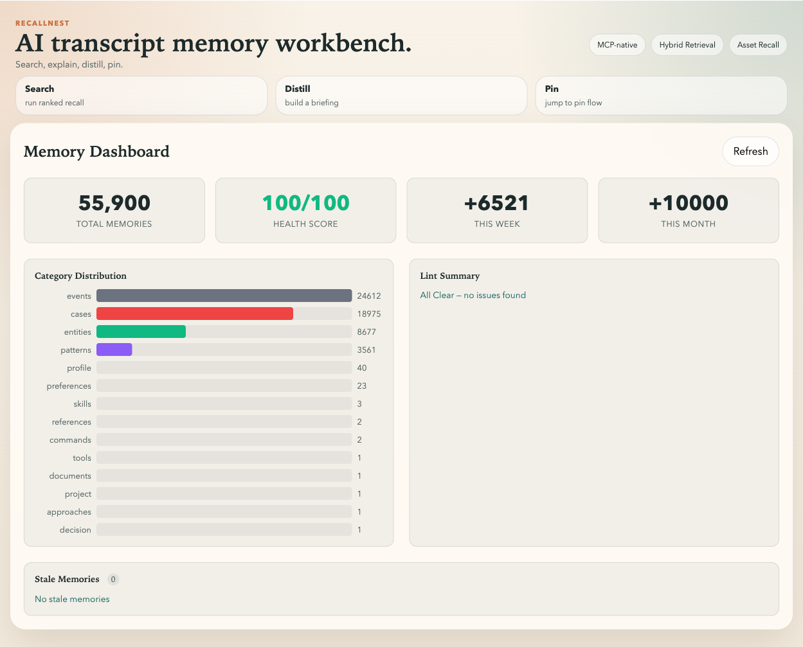

<div align="center">

# RecallNest

**Shared Memory Layer for Every AI Client — CLI agents, desktop apps, your own scripts**

*One memory. Every client. Context that survives across windows — and across machines.*

A local-first memory system backed by LanceDB that turns scattered conversation history into reusable knowledge — shared across your coding agents, recalled automatically.

[](https://github.com/AliceLJY/recallnest)
[](LICENSE)
[](https://bun.sh)
[](https://lancedb.com)
[](https://modelcontextprotocol.io)
[](https://github.com/AliceLJY/recallnest/actions/workflows/ci.yml)
[](https://github.com/AliceLJY/recallnest)

**English** | [简体中文](README_CN.md) | [Roadmap](ROADMAP.md)

</div>

---

## Why RecallNest?

Coding agents forget everything between windows. Your context — project configs, debugging decisions, entity mappings — is scattered across Claude Code, Codex, Kimi, Antigravity — and every other terminal you open — with no shared memory.

RecallNest is **one LanceDB-backed memory layer that all of them read and write**. Context stored in one window is recalled in another. Sessions checkpoint on exit and resume on start. Memory decays, evolves, and self-organizes — it is not a log you grep.

### What a recall actually looks like

```text
Query   : deploy rollback
Hits    : 5

#  ID       Score Category  Tier        Source  Date        Age  Retrieval Path
1  ee79037a 46.1% cases     peripheral  cc      2026-08-25  2d   vector
   [assistant] Rolled back to the previous image and pinned the digest so the next…
   prov : evidence/transcript-ingest
   imgs : 52 agent-made in this session · read sess=dca70d4a
```

Three things in that block carry most of the design:

- **`Source cc` · `Age 2d`** — this came out of a Claude Code window two days ago and you
  are reading it from a different terminal, possibly on a different machine. That is the
  premise the whole project is built on.
- **`prov : evidence/…`** — every row states which layer it sits on. A fragment scraped out
  of a transcript never gets to pose as a decision you actually made; moving to durable
  memory is a separate, gated step with its own evidence requirement.
- **`imgs : …`** — that session contained 52 images. **Not one of them is in the database.**
  The line exists so you know there is something to go look at, and producing it cost no
  model call, no vector, and no storage.

That last one is the approach in miniature: **store what makes a thing findable, not
everything that could ever be asked about it.** The full reasoning — including the two
places where the obvious implementation was wrong — is in
[Images: addressable, not embedded](#images-addressable-not-embedded).


## Core Capabilities

### Access & Setup

| Capability | Description |
|---|---|
| **CC Plugin** | Install in Claude Code with one command — no manual config |
| **Shared Index** | One LanceDB store shared by every terminal that speaks MCP |
| **Dual Interface** | MCP (stdio) for CLI tools + HTTP API for custom agents |
| **One-Click Setup** | Integration scripts install MCP access and continuity rules |

### Recall & Continuity

| Capability | Description |
|---|---|
| **Hybrid Retrieval** | 6-channel: vector + BM25 + L0/L1/L2 multi-vector + KG graph (PPR) |
| **Write-time Triggers** | Each memory can carry 2–6 "how will this be asked about later" phrasings (`triggers`), embedded separately and used only for recall — never rendered as evidence. Borrowed from Tencent T-Mem (EMNLP 2026). |
| **4 Retrieval Profiles** | default, writing, debug, fact-check — tuned for different tasks |
| **Session Continuity** | `checkpoint_session` + `resume_context` (full/light/summary modes) with repo-state guard |
| **Session Distiller** | 3-layer conversation compression: microcompact → LLM summary → knowledge extraction |
| **Conversation Import** | Import from Claude Code, Claude.ai, ChatGPT, Slack, and plaintext |
| **Topic Tags** | Intra-scope topic partitioning — auto-detected, filterable in search |
| **Related Scope Sidecar** | Opt-in `includeRelatedScopes` search over configured `scopeRelations`, shown separately from the main scoped ranking |

### Memory Lifecycle & Governance

| Capability | Description |
|---|---|
| **Memory Evolution** | Supersede chains, decay scoring, LLM importance, consolidation, archival |
| **Smart Promotion** | Evidence → durable memory with conflict guards, merge resolution, and audit trail |
| **Privacy Tiers** | 4-tier (`ephemeral` / `private` / `durable` / `shared`) with cascade forgetting |
| **Admission Control** | Write-time gating: noise filter, importance floor, dedup, rate limiting |
| **Memory Lint** | Contradiction, duplicate, stale, and orphan detection with health score |
| **Offline Consolidation** | `dream` command: clustering, merging, pruning of accumulated memories |

### Reasoning & Structure

| Capability | Description |
|---|---|
| **Knowledge Graph** | Entity relation graph with PPR algorithm for multi-hop questions |
| **Constructive Retrieval** | Multi-source candidate expansion + grounded context reconstruction |
| **Narrative Architecture** | 3-layer autobiographical metadata (life-period → general-event → specific-event) |
| **Skill Memory** | Store, retrieve, and promote executable skills from recurring patterns |
| **Predictive Reminders** | Behavioral-signal prediction engine surfaces "you might need this" suggestions |
| **6 Categories** | profile, preferences, entities, events, cases, patterns — with category-aware merge strategies |

### Visibility & Operations

| Capability | Description |
|---|---|
| **Dashboard** | Web UI with stats, category distribution, growth trends, and health |
| **Workflow Observation** | Dedicated append-only workflow health records, outside regular memory |
| **Structured Assets** | Pins, briefs, and distilled summaries — not just raw logs |
| **Data Checkup** | Data quality health checks on the memory store (including source health) |
| **Source Heartbeats** | Automatic ingest health tracking per data source with staleness alerts |
| **Export Graph** | Export interactive HTML knowledge graph visualization |
| **Batch Operations** | Store up to 20 memories in a single call with dedup |
| **Connector Framework** | Standard connector-v1 format for external data sources with example adapters |

---

## Architecture

```
  CLIENTS                    ACCESS                      CORE ENGINE                    STORAGE
  ──────────────────────     ───────────────────────     ────────────────────────────   ──────────────────────

  Claude Code                MCP over stdio              Retriever                      LanceDB
  Codex                ───▶  44 tools, 3 tiers    ───▶   weighted vector + BM25  ───▶   vector + columnar
  Kimi · Antigravity                                     Classifier · 6 categories
  Doubao desktop                                         Context composer
                             HTTP API :4318              resume_context                 Jina embeddings v5
  your scripts · cron  ───▶  21 endpoints          ───▶  Decay · Weibull half-life ─▶   1024-dim, task-aware
                                                         Conflict · audit + merge
  phone app            ───▶  read-only gateway     ───▶  Capture: evidence → durable
                             :8791, token-gated
```

### Internal Design

- **L0 / L1 / L2 Dynamic Folding** — every memory stores 3 granularity layers (one-liner / bullet summary / full content); retrieval dynamically selects which layer to return based on relevance score and token budget
- **Weibull Decay + Emotion Modulation** — memories decay along a parametric Weibull curve; importance scores modulate the half-life, and emotional salience extends it further (up to 30%)
- **Vector Pre-filter + LLM Dedup** — 90% of dedup decisions use cheap cosine similarity (>= 0.92); only borderline cases invoke LLM judgment, keeping costs low without sacrificing accuracy
- **Category-Aware Merge Strategies** — `profile` and `preferences` use merge-on-conflict (latest wins); `events` and `cases` use append-only (history preserved)
- **Write-time Rehearsal (Triggers)** — a memory stored with `triggers: ["别人的榜我们要不要也去排个名", ...]` gets each phrasing embedded on the query side into a side table (`memory_triggers`); at recall time the query is matched against triggers, the best-matching trigger pulls its host memory into the candidate pool (max-over-triggers attribution, cosine hard gate + lexical soft gate), and the host then goes through the normal scoring chain. Triggers never appear in results — they are an entry point, not evidence. `RECALLNEST_TRIGGER_RECALL=false` turns it off; `triggers-backfill` / `triggers-calibrate` CLI manage existing data
- **Display Score vs Elimination Score** — dual-track retrieval: tier floor prevents core memories from ever dropping out, while decay boost lets fresh memories surface temporarily without permanently displacing stable ones

> Full architecture deep-dive: [`docs/architecture.md`](docs/architecture.md)

---

## Who Can Connect

**The data layer does not know what your client looks like.** RecallNest exposes the same LanceDB store through three outlets, so the right one is picked per client — not per protocol.

| What your client can do | Route | Verified with |
|---|---|---|
| Run a local command (CLI agent) | **MCP over stdio** | Claude Code, Codex, Kimi, Antigravity |
| Run a local command (GUI app, MCP config filled by hand) | **MCP over stdio** | Doubao desktop — same shape as Cherry Studio / ChatBox |
| Only speak HTTP | **HTTP API** | custom agents, scripts, cron |
| Run on another machine | swap the stdio command for `ssh <host> recallnest-mcp` | four clients on a laptop reading one store on a home server |

Two consequences worth stating plainly:

- **Not tied to one protocol.** A GUI chat app that supports MCP config connects the same way a terminal agent does. A client that can only issue HTTP requests still reads the same memory.
- **Not tied to one machine.** Because the MCP transport is stdio, the launch command is yours to define — point it at `ssh` and every client on every machine shares a single source of truth instead of each host growing its own database.

Adding a client does not mean changing RecallNest. A capable client writes one config line; a limited one gets a thin gateway in front of the HTTP API.

### AI apps on a phone: the read-only gateway

The HTTP API (`:4318`) binds to `127.0.0.1` and rejects any request whose Host header is not local. That is **deliberate** — it also exposes write routes (`/v1/store`, `/v1/checkpoint`), so putting it on a public address would hand out write access.

To let an AI app on your phone read the same memory, put a read-only gateway in front:

```bash
openssl rand -hex 32 > ~/.config/recallnest/gateway-token
chmod 600 ~/.config/recallnest/gateway-token

bun run api        # local API on :4318
bun run gateway    # read-only gateway on :8791 → forwards to :4318
```

The gateway allows read routes only (`/recall`, `/search`, `/stats`, `/health`); **every write route is a 404**. Bearer token compared in constant time, per-minute rate limit, hard caps on request and response size. Put it behind a tunnel (Tailscale Serve/Funnel, Cloudflare Tunnel, …) to reach it from a phone.

```bash
curl -X POST https://<your-tunnel>/recall \
  -H "Authorization: Bearer $(cat ~/.config/recallnest/gateway-token)" \
  -H 'content-type: application/json' \
  -d '{"query":"how did we fix that deploy issue","limit":3,"allScopes":true}'
```

Optional: set `RECALLNEST_GATEWAY_FILE_ROOTS="notes=/abs/path,wiki=/abs/path"` to add `GET /files/search`, a read-only ripgrep search over markdown directories you name (the query is passed as an argv element, never through a shell). Leave it unset and the route does not exist.

> The gateway also binds to `127.0.0.1` by default — exposing it is the tunnel's job. Evaluate that risk yourself.

This is how the author connected [OpenMinis](https://github.com/OpenMinis/OpenMinis) on an iPhone: the phone app reaches the gateway over a Tailscale Funnel and queries the same memory store. The interesting part is what it reads back — its own history. Those conversations get exported, flow back, and are indexed, so a phone agent that cold-starts every time ends up with memory that survives its sessions.


## Quick Start

### Option A: Claude Code Plugin (recommended)

```bash
/plugin marketplace add AliceLJY/recallnest
/plugin install recallnest@AliceLJY
```

RecallNest starts automatically with Claude Code. No manual MCP config needed.

Claude Code prompts for a Jina API key during installation. The key is stored through Claude Code's sensitive plugin configuration, while the generated config and LanceDB database live in the plugin's persistent data directory rather than the versioned plugin cache.

> The Claude Code plugin and npm package share one release version and are updated together.
>
> **Requires:** [Bun](https://bun.sh). Dependencies install on first start.

### Option B: npm install

```bash
npx recallnest --help          # run directly
# or
npm install -g recallnest      # install globally
recallnest doctor
```

Works with Node.js 22+ (via tsx) or Bun. No git clone needed.

### Option C: Manual setup

```bash
git clone https://github.com/AliceLJY/recallnest.git
cd recallnest
bun install
cp config.json.example config.json
cp .env.example .env
# Edit .env → add your JINA_API_KEY
```

### Start the server

```bash
bun run api
# → RecallNest API running at http://localhost:4318
```

### Try it

```bash
# Store a memory
curl -X POST http://localhost:4318/v1/store \
  -H "Content-Type: application/json" \
  -d '{"text": "User prefers dark mode", "category": "preferences"}'

# Recall memories
curl -X POST http://localhost:4318/v1/recall \
  -H "Content-Type: application/json" \
  -d '{"query": "user preferences"}'

# Check stats
curl http://localhost:4318/v1/stats
```

### Connect your terminals

```bash
bash integrations/claude-code/setup.sh
bash integrations/agy/setup.sh
bash integrations/codex/setup.sh
```

Each script installs MCP access and managed continuity rules, so `resume_context` fires automatically in fresh windows.

### Index existing conversations

```bash
bun run src/cli.ts ingest --source all
bun run seed:continuity
bun run src/cli.ts doctor
```

---

## Images: addressable, not embedded

Conversations contain images. A text memory layer does not. The usual answer is a
multimodal embedding model — encode every image into the same space as the text. That is
right for photo libraries. It is the wrong shape here, for a cheap reason: **in a
conversation an image almost never arrives alone.** It comes wrapped in "look at this
error", and the reply right after it usually describes what was in the picture. The words
around the image are already an index of it. What was missing was never semantic search
over pixels — it was knowing a picture is sitting there at all.

So RecallNest does not encode images. It records **how many images are in the session a
memory came from**, and lets you decide whether to open the original transcript. Meaning
is resolved on demand, by whatever model is asking, at the moment it matters.

The cost is worth stating plainly: **no multimodal model, no re-embedding, no image
storage, no change to any vector.** Backfilling 21,319 existing memories touched metadata
only.

Two design choices in it were not obvious, and both were wrong on the first attempt.

### Session-level, on purpose

The marker counts the whole session, not the turn — coarser than it first looks like it
should be, and the coarseness is the point.

A turn that is nothing but a pasted screenshot has almost no text, so it never cleared the
length gate and never entered the store. Measured on real transcripts, **12.5% of turns
containing a pasted image were dropped whole** — including the ones worth the most, like
seven screenshots with no caption, or "here are the steps" attached to a picture that *is*
the steps. A turn-level marker has nothing to attach to for exactly those. A session-level
marker lands on that session's *other* memories, which did get stored, and those are what
a search surfaces.

The trade-off is undisguised: every memory from a session carries the same count, so the
images may have nothing to do with the row you are looking at. The line says
`in this session`, not `in this memory`, for that reason.

### Two classes, because they answer different questions

| Bucket | What it is | The question it answers |
|---|---|---|
| user-pasted | Pictures a human put into a message | *Where is that screenshot I sent?* |
| agent-made | Everything else the session produced | *What did the page look like? What did I generate?* |

Keeping only the first is tempting — a person searching their own memory wants their own
screenshots. But an agent reconstructing its past work wants the other: the diagram it
drew, the rendering it captured, the illustration it made for a post. **Of 1,767 sessions
carrying images, 1,103 contain no human-pasted image at all.** Keep one bucket and those
sessions go silent — precisely the ones where the agent did visual work.

### The second bucket is a complement, not a list

The first implementation defined agent-made images by enumeration: inside `tool_result`,
inside `payload.output`, inside `tool.result`. Every location was real. The list was still
wrong, because **the set of ways an image can appear only grows**, and an enumeration
silently drops whatever it did not anticipate.

So the second bucket is a complement: count every image signal in the record, subtract the
ones positively identified as human-pasted, attribute the rest without asking where it came
from. Across 9,619 transcripts:

| | Enumerated | Complement |
|---|---|---|
| Agent-made images | 5,812 | **10,938** |
| Sessions with any image | 1,507 | **1,767** |
| Human-pasted images | 1,629 | 1,629 |

**The enumeration missed 5,126 images and 376 sessions** — nearly half. The largest class
it dropped was image *generation*, which lives in neither container the list knew about.
Human-pasted counts are identical under both definitions, which is the check that matters:
widening the second bucket did not contaminate the precise one. A regression test feeds the
parser an `image_generation_call` — a shape the source never names — and asserts it lands
in the second bucket; under the enumerated implementation that test fails.

One caveat: the complement counts *signals*, not certified pictures. A single generation can
leave both a call and a completion record and be counted twice. That direction was chosen
deliberately — the question is "is there anything here to look at", not "exactly how many".


## Interfaces

RecallNest serves two interfaces:

- **MCP (stdio)** — for any client that can launch a command: CLI agents (Claude Code, Codex, Kimi, Antigravity) and GUI apps that accept an MCP config (Doubao, Cherry Studio, ChatBox)
- **HTTP API** — for custom agents, SDK-based apps, and any HTTP client

### Agent framework examples

Examples live in [`integrations/examples/`](integrations/examples/):

| Framework | Example | Language |
|-----------|---------|----------|
| [Claude Agent SDK](integrations/examples/claude-agent-sdk/) | `memory-agent.ts` | TypeScript |
| [OpenAI Agents SDK](integrations/examples/openai-agents-sdk/) | `memory-agent.py` | Python |
| [LangChain](integrations/examples/langchain/) | `memory-chain.py` | Python |

---

<details>
<summary><strong>MCP Tools (44 tools)</strong></summary>

| Tool | Description |
|------|-------------|
| `workflow_observe` | Store an append-only workflow observation outside regular memory; accepts `idempotencyKey` for retry-safe writes |
| `workflow_health` | Inspect workflow observation health or show a degraded-workflow dashboard |
| `workflow_evidence` | Build an evidence pack for a workflow primitive |
| `store_memory` | Store a durable memory for future windows |
| `store_workflow_pattern` | Store a reusable workflow as durable `patterns` memory |
| `store_case` | Store a reusable problem-solution pair as durable `cases` memory |
| `promote_memory` | Explicitly promote evidence into durable memory |
| `promote_scan` | Scan recent evidence and auto-promote qualifying memories into durable storage |
| `promote_synthesis` | Scan dream-synthesized conclusions and promote the ones their own evidence set supports |
| `list_conflicts` | List or inspect promotion conflict candidates |
| `audit_conflicts` | Summarize stale/escalated conflict priorities |
| `escalate_conflicts` | Preview or apply conflict escalation metadata |
| `resolve_conflict` | Resolve a stored conflict candidate (keep / accept / merge) |
| `checkpoint_session` | Store the current active work state outside durable memory; accepts `idempotencyKey` for retry-safe writes |
| `latest_checkpoint` | Inspect the latest saved checkpoint by session or scope |
| `resume_context` | Compose startup context for a fresh window |
| `search_memory` | Proactive recall at task start |
| `explain_memory` | Explain why memories matched |
| `distill_memory` | Distill results into a compact briefing |
| `brief_memory` | Create a structured brief and re-index it |
| `pin_memory` | Promote a scoped memory into a pinned asset |
| `export_memory` | Export a distilled memory briefing to disk |
| `list_pins` | List pinned memories |
| `list_assets` | List all structured assets |
| `list_dirty_briefs` | Preview outdated brief assets created before the cleanup rules |
| `clean_dirty_briefs` | Archive dirty brief assets and remove their indexed rows |
| `memory_stats` | Show index statistics |
| `memory_drill_down` | Inspect a specific memory entry with full metadata and provenance |
| `auto_capture` | Heuristically extract and store memory signals from text (zero LLM calls) |
| `set_reminder` | Set a prospective memory reminder to surface in a future session |
| `consolidate_memories` | Cluster near-duplicate memories and merge them (dry-run by default) |
| `store_skill` | Store an executable skill with trigger conditions and verification |
| `retrieve_skill` | Retrieve matching executable skills by semantic similarity |
| `scan_skill_promotions` | Scan cases/patterns for promotion candidates to skills |
| `manage_alias` | Add, remove, list, or explain user query aliases for BM25 retrieval |
| `list_tools` | Discover available tools by tier (core/advanced/full) |
| `batch_store` | Store up to 20 memories in a single call with dedup |
| `distill_session` | Distill a conversation into structured knowledge via 3-layer pipeline |
| `import_conversations` | Import conversations from Claude Code, ChatGPT, Slack, and more |
| `data_checkup` | Run data quality health checks on the memory store |
| `dream` | Run offline memory consolidation (clustering, merging, pruning) |
| `memory_lint` | Run memory quality checks: contradictions, duplicates, stale entries, orphans |
| `forget_memory` | Cascade-delete a memory with KG cleanup, pin archival, and audit trail |
| `export_graph` | Export memories as an interactive HTML knowledge graph |

</details>

<details>
<summary><strong>HTTP API (21 endpoints)</strong></summary>

Base URL: `http://localhost:4318`

| Endpoint | Method | Description |
|----------|--------|-------------|
| `/v1/recall` | POST | Quick semantic search |
| `/v1/store` | POST | Store a new memory |
| `/v1/capture` | POST | Store multiple structured memories |
| `/v1/pattern` | POST | Store a structured workflow pattern |
| `/v1/case` | POST | Store a structured problem-solution case |
| `/v1/promote` | POST | Promote evidence into durable memory |
| `/v1/conflicts` | GET | List or inspect promotion conflict candidates |
| `/v1/conflicts/audit` | GET | Summarize stale/escalated conflict priorities |
| `/v1/conflicts/escalate` | POST | Preview or apply conflict escalation metadata |
| `/v1/conflicts/resolve` | POST | Resolve a stored conflict candidate (keep / accept / merge) |
| `/v1/checkpoint` | POST | Store the current work checkpoint |
| `/v1/workflow-observe` | POST | Store a workflow observation outside durable memory |
| `/v1/checkpoint/latest` | GET | Fetch the latest checkpoint by session or scope |
| `/v1/workflow-health` | GET | Inspect workflow health or return a degraded-workflow dashboard |
| `/v1/workflow-evidence` | GET | Build a workflow evidence pack from recent issue observations |
| `/v1/resume` | POST | Compose startup context for a fresh window |
| `/v1/search` | POST | Advanced search with full metadata |
| `/v1/stats` | GET | Memory statistics |
| `/v1/lint` | GET | Memory quality lint report |
| `/v1/health` | GET | Health check |

Full documentation: [`docs/api-reference.md`](docs/api-reference.md)

</details>

<details>
<summary><strong>CLI Commands</strong></summary>

```bash
# Search & explore
bun run src/cli.ts search "your query"
bun run src/cli.ts explain "your query" --profile debug
bun run src/cli.ts distill "topic" --profile writing
bun run src/cli.ts stats

# Workflow observation
bun run src/cli.ts workflow-observe resume_context "Fresh window skipped continuity recovery." --outcome missed --scope project:recallnest --idempotency-key smoke-2026-06-26
bun run src/cli.ts workflow-health resume_context --scope project:recallnest
bun run src/cli.ts workflow-evidence checkpoint_session --scope project:recallnest

# Conflict management
bun run src/cli.ts conflicts list
bun run src/cli.ts conflicts list --attention resolved
bun run src/cli.ts conflicts list --group-by cluster --attention resolved
bun run src/cli.ts conflicts audit
bun run src/cli.ts conflicts audit --export --format md
bun run src/cli.ts conflicts escalate --attention stale
bun run src/cli.ts conflicts show af70545a
bun run src/cli.ts conflicts resolve af70545a --keep-existing
bun run src/cli.ts conflicts resolve af70545a --merge
bun run src/cli.ts conflicts resolve --all --keep-existing --status open

# Memory health & visualization
bun run src/cli.ts lint                         # memory quality report
bun run src/cli.ts lint --scope project:myapp   # lint a specific scope
bun run src/cli.ts graph --open                 # export & open knowledge graph
bun run src/cli.ts graph --max-nodes 50         # smaller graph

# Ingestion & diagnostics
bun run src/cli.ts ingest --source all
bun run src/cli.ts doctor
```

</details>

---

## Web UI

<p align="center">
  
  <br><em>Dashboard — total count, category distribution, health score, and growth trends at a glance.</em>
</p>

<p align="center">
  
  <br><em>Search Workbench — hybrid search with topic tag filtering, 4 retrieval profiles, Skills browser, and asset management.</em>
</p>

<p align="center">
  
  <br><em>Knowledge Graph — interactive force-directed visualization with semantic bridges revealing cross-domain connections.</em>
</p>

```bash
bun run src/ui-server.ts
# → http://localhost:4317
```

---

## What's new

**v3.0** raised the runtime floor to **Node 22** (the only breaking change — Bun users are
unaffected) and gave synthesized conclusions a road into stable memory: a `dream` insight
can now be promoted on the strength of its own validated evidence set, instead of being
permanently stuck on the evidence layer where nothing downstream could lean on it.

It also fixed a rate-limit reply that could trigger an unbounded request storm — measured
at over 61,000 requests in five seconds against an endpoint asking us to slow down. Found
by the new HTTP contract tests, which drive the real client classes against a loopback
server instead of stubbing the SDK.

Existing LanceDB data opens in place; there is no export or import step.

**Full history — v3.0 through v1.0, with the upgrade notes for each — is in
[CHANGELOG.md](CHANGELOG.md).**


## Multilingual Support

RecallNest works out of the box with English. For multilingual memory (Chinese, Japanese, Thai, and 20+ more), install [babel-memory](https://github.com/AliceLJY/babel-memory) with the language packs you need:

```bash
# Chinese
npm install babel-memory jieba-wasm

# Japanese
npm install babel-memory @sglkc/kuromoji

# Thai
npm install babel-memory wordcut

# European languages (German, French, Spanish, Russian, etc.)
npm install babel-memory snowball-stemmers

# Multiple languages at once
npm install babel-memory jieba-wasm @sglkc/kuromoji snowball-stemmers
```

RecallNest auto-detects babel-memory at startup — no configuration needed. Without babel-memory, RecallNest still works perfectly with standard BM25 text search.

---

## Project Status & Roadmap

RecallNest is actively maintained. All major architecture phases are complete — see the full [Roadmap](ROADMAP.md) for current priorities and future plans.

Maintainers: see [Publishing RecallNest](https://github.com/AliceLJY/recallnest/blob/main/docs/releasing.md) for the npm Trusted Publishing, validation, and recovery process.

---

## Relationship to memory-lancedb-pro

RecallNest started as a fork of [memory-lancedb-pro](https://github.com/CortexReach/memory-lancedb-pro) and shares its core ideas around hybrid retrieval, decay modeling, and memory-as-engineering-system. The key difference:

- **memory-lancedb-pro** is an OpenClaw plugin — it adds long-term memory to a single OpenClaw agent.
- **RecallNest** is a standalone memory layer — it serves CLI agents, GUI chat apps and plain HTTP callers simultaneously through MCP + HTTP API, with session continuity, structured assets, and conflict management built in.

## Credit

| Source | Contribution |
|--------|-------------|
| [memory-lancedb-pro](https://github.com/CortexReach/memory-lancedb-pro) by [@win4r](https://github.com/win4r) | Fork base — hybrid retrieval, decay modeling, and memory architecture |
| Claude Code | Foundation and early project scaffolding |
| OpenAI Codex | Productization and MCP expansion |

Special thanks to Qin Chao ([@win4r](https://github.com/win4r)) and the [CortexReach](https://github.com/CortexReach) team for the foundational work.

<details>
<summary><strong>Ecosystem</strong></summary>

Part of the **小试AI** open-source AI workflow:

| Project | Description |
|---------|-------------|
| [babel-memory](https://github.com/AliceLJY/babel-memory) | Multilingual preprocessing for BM25 — 27+ languages, zero deps |
| cc-empire *(private)* | Hooks/rules/methodology — the connective tissue of the whole ecosystem |
| [telegram-ai-bridge](https://github.com/AliceLJY/telegram-ai-bridge) | Telegram bots for Claude, Codex, Agy, and Kimi |
| [tg-bridge-channel](https://github.com/AliceLJY/tg-bridge-channel) | Sister Telegram bridge using Claude Agent View background sessions |
| [wechat-ai-bridge](https://github.com/AliceLJY/wechat-ai-bridge) | Run Claude Code / Codex in WeChat with session management |
| [openclaw-tunnel](https://github.com/AliceLJY/openclaw-tunnel) | Docker ↔ host CLI bridge (maintenance mode — LanceDB test only) |
| [digital-clone-skill](https://github.com/AliceLJY/digital-clone-skill) | Build digital clones from corpus data |
| [claude-code-studio](https://github.com/AliceLJY/claude-code-studio) | Multi-session collaboration platform for Claude Code |
| [workflow-orchestrator](https://github.com/AliceLJY/workflow-orchestrator) | Natural-language pipeline orchestrator for Claude Code |

</details>

## License

MIT
